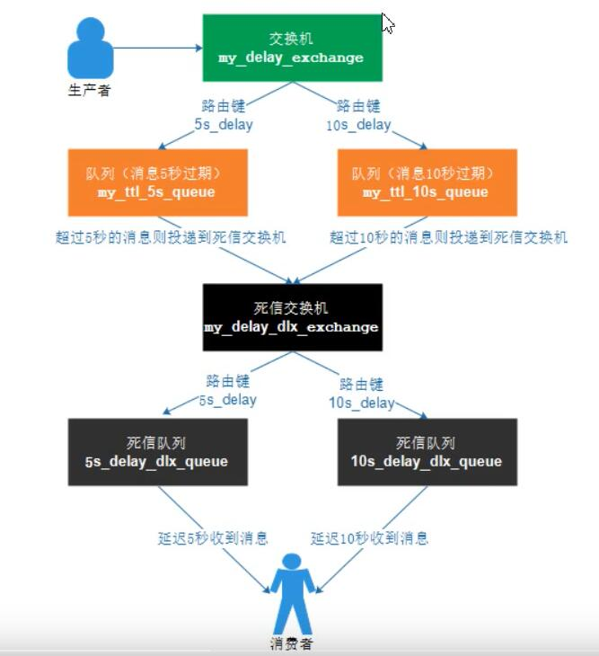
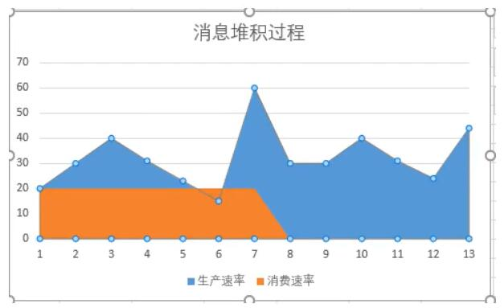
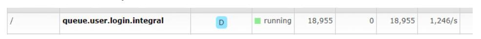
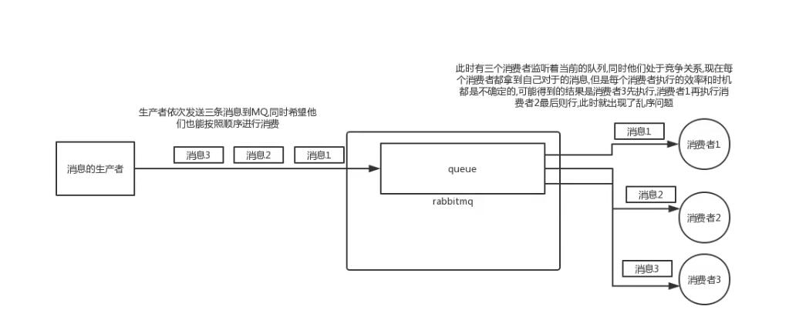
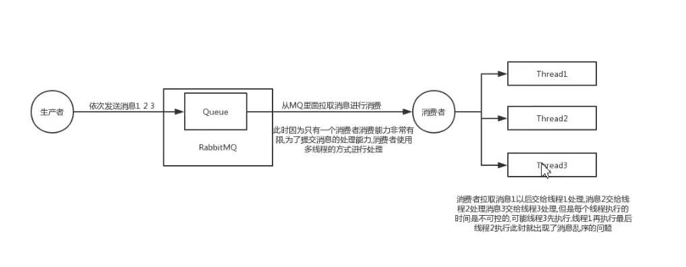
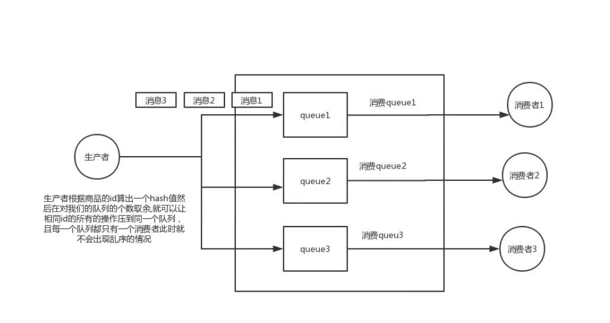

RabbitMq


安装rabbitMq官网下载安装包

解决rabbitmq网页界面打不开问题：

rabbitmq-plugins enable rabbitmq_management

访问地址：http://localhost:15672/#/

用户名：guest

密码： guest 

死信队列：

DLX，全称为Dead-Letter-Exchange , 可以称之为死信交换机，也有人称之为死信邮箱。当消息在一个队列中变成死信(dead message)之后，它能被重新发送到另一个交换机中，这个交换机就是DLX ，绑定DLX的队列就称之为死信队列。  

消息变成死信，可能是由于以下的原因：

- 消息被拒绝
- 消息过期
- 队列达到最大长度

DLX也是一个正常的交换机，和一般的交换机没有区别，它能在任何的队列上被指定，实际上就是设置某一个队列的属性。当这个队列中存在死信时，Rabbitmq就会自动地将这个消息重新发布到设置的DLX上去，进而被路由到另一个队列，即死信队列。  

要想使用死信队列，只需要在定义队列的时候设置队列参数 `x-dead-letter-exchange` 指定交换机即可。

具体步骤如下面的章节。


```xaml
   <!--定义过期队列及其属性，不存在则自动创建-->
    <rabbit:queue id="my_ttl_queue" name="my_ttl_queue" auto-declare="true">
        <rabbit:queue-arguments>
            <!--投递到该队列的消息如果没有消费都将在6秒之后被删除-->
            <entry key="x-message-ttl" value-type="long" value="6000"/>
        </rabbit:queue-arguments>
    </rabbit:queue>
    <!--定义定向交换机中的持久化死信队列，不存在则自动创建-->
    <rabbit:queue id="my_dlx_queue" name="my_dlx_queue" auto-declare="true"/>
    <!--定义广播类型交换机；并绑定上述两个队列-->
    <rabbit:direct-exchange id="my_dlx_exchange" name="my_dlx_exchange" auto-declare="true">
        <rabbit:bindings>
            <rabbit:binding key="my_ttl_dlx" queue="my_dlx_queue"/>
            <rabbit:binding key="my_max_dlx" queue="my_dlx_queue"/>
        </rabbit:bindings>
    </rabbit:direct-exchange>
    <!--定义过期队列及其属性，不存在则自动创建-->
    <rabbit:queue id="my_ttl_dlx_queue" name="my_ttl_dlx_queue" auto-declare="true">
        <rabbit:queue-arguments>
            <!--投递到该队列的消息如果没有消费都将在6秒之后被投递到死信交换机-->
            <entry key="x-message-ttl" value-type="long" value="6000"></entry>
            <!--设置当消息过期后投递到对应的死信交换机-->
            <entry key="x-dead-letter-exchange"  value="my_dlx_exchange"></entry>
        </rabbit:queue-arguments>
    </rabbit:queue>

    <!--定义限制长度的队列及其属性，不存在则自动创建-->
    <rabbit:queue id="my_max_dlx_queue" name="my_max_dlx_queue" auto-declare="true">
        <rabbit:queue-arguments>
            <!--投递到该队列的消息最多2个消息，如果超过则最早的消息被删除投递到死信交换机-->
            <entry key="x-max-length" value-type="long" value="2"></entry>
            <!--设置当消息过期后投递到对应的死信交换机-->
            <entry key="x-dead-letter-exchange" value="my_dlx_exchange"></entry>
        </rabbit:queue-arguments>
    </rabbit:queue>
    <!--定义定向交换机 根据不同的路由key投递消息-->
    <rabbit:direct-exchange id="my_normal_exchange" name="my_normal_exchange" auto-declare="true">
        <rabbit:bindings>
            <rabbit:binding key="my_ttl_dlx" queue="my_ttl_dlx_queue"/>
            <rabbit:binding key="my_max_dlx" queue="my_max_dlx_queue"/>
        </rabbit:bindings>
    </rabbit:direct-exchange>

    <!-- publisher-confirms="true" 表示：启用了消息确认 -->
    <rabbit:connection-factory id="connectionFactory" host="localhost"
                               port="5672"
                               username="zhanglu"
                               password="123456"
                               virtual-host="/"
                               publisher-returns="true"/>
    <!-- 消息回调处理类 -->
    <bean id="confirmCallback" class="com.zl.rabbit.config.MsgSendConfirmCallBack"/>
<!--    &lt;!&ndash;定义rabbitTemplate对象操作可以在代码中方便发送消息&ndash;&gt;-->
<!--    &lt;!&ndash; confirm-callback="confirmCallback" 表示：消息失败回调 &ndash;&gt;-->
<!--    <rabbit:template id="rabbitTemplate" connection-factory="connectionFactory"-->
<!--                     confirm-callback="confirmCallback"/>-->

    <!-- publisher-returns="true" 表示：启用了失败回调 -->

    <!-- 消息失败回调类 -->
    <bean id="sendReturnCallback" class="com.zl.rabbit.config.MsgSendReturnCallback"/>
    <!-- return-callback="sendReturnCallback" 表示：消息失败回调 ,同时需配置mandatory="true"，否则消息则丢失-->
    <rabbit:template id="rabbitTemplate" connection-factory="connectionFactory"
                     confirm-callback="confirmCallback" return-callback="sendReturnCallback"
                     mandatory="true"/>

```

延迟队列


延迟队列储存的对象是对应的延迟消息；所谓“延迟消息”是指消息发送后不想消费者立刻拿到消息，而是等待特定的时间后，才可以拿到。


在rabbitmq中可延迟队列可以使用  过期时间+死信队列来实现

  

设置5秒过期后，死信交换机接收到消息通过路由键发送到对应的队列上，从而实现消费者5秒后接收到消息

## 10.1. 消息堆积

当消息生产的速度长时间，远远大于消费的速度时。就会造成消息堆积。



- 消息堆积的影响
  - 可能导致新消息无法进入队列
  - 可能导致旧消息无法丢失
  - 消息等待消费的时间过长，超出了业务容忍范围。
- 产生堆积的情况
  - 生产者突然大量发布消息
  - 消费者消费失败
  - 消费者出现性能瓶颈。
  - 消费者挂掉
- 解决办法
  - 排查消费者的消费性能瓶颈
  - 增加消费者的多线程处理
  - 部署增加多个消费者
- 场景介绍

在用户登录成功之后，会向rabbitmq发送一个登录成功的消息。这个消息可以被多类业务订阅。

登录成功，记录登录日志；登录成功，根据规则送积分。其中登录送积分可以模拟成较为耗时的处理

**场景重现**：让消息产生堆积

1. 生产者大量发送消息：使用Jmeter开启多线程，循环发送消息大量进入队列。

   

   模拟堆积10万条数据

   

2. 消费者消费失败：随机抛出异常，模拟消费者消费失败，没有ack（手动ack的时候）。

3. 设置消费者的性能瓶颈：在消费方法中设置休眠时间，模拟性能瓶颈

4. 关闭消费者：停掉消费者，模拟消费者挂掉

5. 消费者端示例核心代码：

```
public class LoginIntegralComsumer implements MessageListener {
    public void onMessage(Message message) {
        String jsonString = null;
        try {
            jsonString = new String(message.getBody(),"UTF8");
        } catch (UnsupportedEncodingException e) {
            e.printStackTrace();
        }
        if(new Random().nextInt(5)==2){
            //模拟发生异常
            throw new RuntimeException("模拟处理异常");
        }
        try {
            //模拟耗时的处理过程
            TimeUnit.MILLISECONDS.sleep(1000);
            System.out.println(Thread.currentThread().getName()+"处理消息:"+jsonString);
        } catch (InterruptedException e) {
            e.printStackTrace();
        }
    }
}
```

1. 如果每1秒钟处理一条消息

1小时处理 60*60=3600条

处理完10万条数据 100000/3600=27.7小时  

 

**问题解决**：消息已经堆积如何解决

 

消息队列堆积，想办法把消息转移到一个新的队列，增加服务器慢慢来消费这个消息可以

 

生产环境的队列可用状态

 

 

1、解决消费者消费异常问题

2、解决消费者的性能瓶颈：改短休眠时间

```
5.4小时。
```

3、增加消费线程，增加多台服务器部署消费者。快速消费。

 增加10个线程

```
concurrency="10" prefetch="10"
```

1小时  

增加一台服务器

0.5小时

 

 

 


## 10.2. 消息丢失

在实际的生产环境中有可能出现一条消息因为一些原因丢失，导致消息没有消费成功，从而造成数据不一致等问题，造成严重的影响，比如：在一个商城的下单业务中，需要生成订单信息和扣减库存两个动作，如果使用RabbitMQ来实现该业务，那么在订单服务下单成功后需要发送一条消息到库存服务进行扣减库存，如果在此过程中，一条消息因为某些原因丢失，那么就会出现下单成功但是库存没有扣减，从而导致超卖的情况，也就是库存已经没有了，但是用户还能下单，这个问题对于商城系统来说是致命的。  

消息丢失的场景主要分为：消息在生产者丢失，消息在RabbitMQ丢失，消息在消费者丢失。

### 10.2.1. 消息在生产者丢失

#### 场景介绍

​	消息生产者发送消息成功，但是MQ没有收到该消息，消息在从生产者传输到MQ的过程中丢失，一般是由于网络不稳定的原因。

 

#### 解决方案

​	采用RabbitMQ 发送方消息确认机制，当消息成功被MQ接收到时，会给生产者发送一个确认消息，表示接收成功。RabbitMQ 发送方消息确认模式有以下三种：普通确认模式，批量确认模式，异步监听确认模式。spring整合RabbitMQ后只使用了异步监听确认模式。  

***说明\***

​	异步监听模式，可以实现边发送消息边进行确认，不影响主线程任务执行。

***步骤\***

1. 生产者发送3000条消息

2. 在发送消息前开启开启发送方确认模式

   ```
       <rabbit:connection-factory id="connectionFactory" host="${rabbitmq.host}"
   ```

   ```
                                  port="${rabbitmq.port}"
   ```

   ```
                                  username="${rabbitmq.username}"
   ```

   ```
                                  password="${rabbitmq.password}"
   ```

   ```
                                  virtual-host="${rabbitmq.virtual-host}"
   ```

   ```
                                  publisher-confirms="true"
   ```

   ```
           />
   ```

    

3. 在发送消息前添加异步确认监听器

   ```
   //添加异步确认监听器
   ```

   ```
   rabbitTemplate.setConfirmCallback(new RabbitTemplate.ConfirmCallback() {
   ```

   ```
       public void confirm(CorrelationData correlationData, boolean ack, String cause) {
   ```

   ```
           if (ack) {
   ```

   ```
               // 处理ack
   ```

   ```
               System.out.println("已确认消息，标识：" + correlationData.getId());
   ```

   ```
           } else {
   ```

   ```
               // 处理nack, 此时cause包含nack的原因。
   ```

   ```
               System.out.println("未确认消息，标识：" + correlationData.getId());
   ```

   ```
               System.out.println("未确认原因：" + cause);
   ```

   ```
               //重发
   ```

   ```
           }
   ```

   ```
       }
   ```

   ```
   });
   ```

 


### 10.2.2. 消息在RabbitMQ丢失

#### 场景介绍

​	消息成功发送到MQ，消息还没被消费却在MQ中丢失，比如MQ服务器宕机或者重启会出现这种情况

 

 

#### 解决方案

​	持久化交换机，队列，消息，确保MQ服务器重启时依然能从磁盘恢复对应的交换机，队列和消息。

spring整合后默认开启了交换机，队列，消息的持久化，所以不修改任何设置就可以保证消息不在RabbitMQ丢失。但是为了以防万一，还是可以申明下。

 

 

 

### 10.2.3. 消息在消费者丢失

 

#### 场景介绍

​	消息费者消费消息时，如果设置为自动回复MQ，消息者端收到消息后会自动回复MQ服务器，MQ则会删除该条消息，如果消息已经在MQ被删除但是消费者的业务处理出现异常或者消费者服务宕机，那么就会导致该消息没有处理成功从而导致该条消息丢失。  

 

#### 解决方案

​	设置为手动回复MQ服务器，当消费者出现异常或者服务宕机时，MQ服务器不会删除该消息，而是会把消息重发给绑定该队列的消费者，如果该队列只绑定了一个消费者，那么该消息会一直保存在MQ服务器，直到消息者能正常消费为止。本解决方案以一个队列绑定多个消费者为例来说明，一般在生产环境上也会让一个队列绑定多个消费者也就是工作队列模式来减轻压力，提高消息处理效率  

​	MQ重发消息场景：

​	1.消费者未响应ACK，主动关闭频道或者连接

​	2.消费者未响应ACK，消费者服务挂掉

 

 

 

## 10.3. 有序消费消息

### 10.3.1. 场景介绍

**场景1**

当RabbitMQ采用work Queue模式，此时只会有一个Queue但是会有多个Consumer,同时多个Consumer直接是竞争关系，此时就会出现MQ消息乱序的问题。



**场景2**

当RabbitMQ采用简单队列模式的时候,如果消费者采用多线程的方式来加速消息的处理,此时也会出现消息乱序的问题。



### 10.3.2. 场景1解决

 



 

### 10.3.3. 场景2解决

:如果key不存在则插入成功且返回1,如果key存在,则不进行任何操作,返回0

 

 

 

 