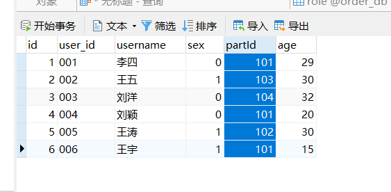
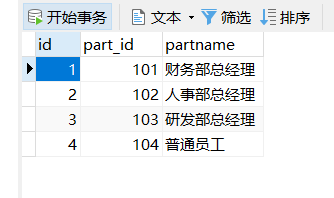

部分sql

name  subject mark 

张三    英语     80

李四  数学    70

张三    数学   60

李四    英语    96

求平均成绩大于80的学生

select name from table1 group by name having avg(mark)>80

name  subject mark  sex

张三    英语     80   0

李四  数学    70      1

张三    数学   60       0

李四    英语    96      1

查询出所有用户的性别和名称，0为女，1为男

SELECT

CASE

​		

​	WHEN

​		( sex = 0 ) THEN

​			'女' 

​			WHEN ( sex = 1 ) THEN

​			'男' ELSE sex 

​		END AS gender,

​		username 

FROM

​	users

else sex 如果性别不为0或1则为sex值 如果不加为null

查出人员的姓名和年龄，和职位名称 并且以年龄的降序排序

SELECT

​	u.username,

​	u.age,

​	r.partname 

FROM

​	users u

​	LEFT JOIN role r ON u.partId = r.part_id 

ORDER BY

​	age DESC 

查询出姓名为null的人员姓名，年龄和职位名

SELECT

CASE

​	WHEN

​		( u.username IS NULL ) THEN

​			'空' ELSE username 

​			END AS username,

​		u.age,

​		r.partname 

​	FROM

​		users u

​		LEFT JOIN role r ON u.partId = r.part_id

插入一条user_id为“009”，姓名为柳荫，性别为女，年龄为18，部门为人事部总经理

INSERT INTO users ( user_id, username, sex, partId, age ) 

VALUE

​	( "008", "柳茵", 1, 102, 18 )

mysql中null和' '是不一样的

假如有100条数据要查询70到90条数据 ，用mysql分页实现

select * from users limit 70,20

代表的是从第70条开始查，查后面的20条记录，最后是第90条