#### redis

##### redis是什么？

一种基于缓存的非关系型数据库

NoSQL =Not Only SQL（不仅仅是sql）

这些数据库的存储不需要一个固定的格式。


##### 为什么要用redis，解决了什么问题？

> 解耦：

1，方便扩展（数据值间没有关系，很好扩展！）

2，大数据量高性能（redis一秒写8万次，读取11万，NoSQL的缓存记录，是一种细颗粒的缓存，性能高）

3，数据类型是多样型的！

4，传统RDBMS 和 NoSQL

```bash
传统的RDBMS
-结构化组织
-sql
-数据和关系都存在单独的表中
-操作，数据定义语义
-严格的一致性
-基础的事务
```

```bash
NoSQL
-不仅仅是数据
-没有固定的查询语言
-键值对存储，列存储，文档存储，图形数据库（社交关系）
-最终一致性
-CAP定理和BASE （异地多活）
-高性能，高可用，高扩展性
```

redis是单线程！

cpu不是redis的瓶颈，Redis的瓶颈是根据机器内存和网络带宽

##### redis的基本指令！

```redis
-select  number: 选择对应索引的数据库
-set key value:设置key的值
-get key:获取key的value值
-flushdb: 清空当前数据库
-keys *: 获取全部key值
-exists key: 判断key的值是否为空 空0不空1
-move key: 删除当前key的值
-type key: 获取值的类型
-expire key time:设置过期时间
-ttl key:查询当前key的过期时间
-append key value:向某个key追加值，如果key不存在就相当于set -key value
-incr key:自增1
-decr key:自减1
-incrby key value: 可以自定义增量
-getrange key start end:截取字符串[1,3]
-getrange key 0 -1:获取全部字符串，相当于get key
-setrange key index value：替换指定位置开始的字符串！
-setnx key time value:设置key的value在什么time后过期
-setnx key value: 如果key不存在，创建key，如果key存在创建失败
-mset key1 v1 key2 v2 key3 v3: 批量插入
-mget k1 k2 k3: 批量获取
-msetnx key1 v1 key4 v4:批量插入，如果其中key存在，则都失败，为原子性操作
-set user:1 {name:zhangsan,age:3} :设置一个user:1对象 值为json字符来保存一个对象！
-mset user:1:name zhangsan user:1:age 2: 这里的key是一个巧妙的设计# user:{id}:{filed},如此设计在redis中完全ok了！

-mget user:1:name user:1:age :批量获取user对象的值
-getset name value: 先get 再set，如果不存在值，则返回null
-getset name value1:如果存在值，获取原来的值，并设置新的值
```

数据结构是相同的！

string类型的使用场景：value除了是我们的字符串还可以是数字！

- 计数器
- 统计多单位的数量
- 粉丝数
- 对象缓存存储

##### redisTemplate的使用

配置bean

```java
    @Bean
    @SuppressWarnings("all")
    public RedisTemplate<String,Object> redisTemplate(RedisConnectionFactory factory){
        RedisTemplate<String,Object> redisTemplate = new RedisTemplate();
        redisTemplate.setConnectionFactory(factory);
        Jackson2JsonRedisSerializer jackson2JsonRedisSerializer=new Jackson2JsonRedisSerializer(Object.class);
        ObjectMapper om=new ObjectMapper();
        om.setVisibility(PropertyAccessor.ALL, JsonAutoDetect.Visibility.ANY);
        om.enableDefaultTyping(ObjectMapper.DefaultTyping.NON_FINAL);
        jackson2JsonRedisSerializer.setObjectMapper(om);
        StringRedisSerializer stringRedisSerializer=new StringRedisSerializer();

        //key采用string方式序列化
        redisTemplate.setKeySerializer(stringRedisSerializer);
        //hash的key也采用string的序列化
        redisTemplate.setHashKeySerializer(stringRedisSerializer);
        //value序列化采用jackson
        redisTemplate.setValueSerializer(jackson2JsonRedisSerializer);
        //hash的value采用jackson
        redisTemplate.setHashValueSerializer(jackson2JsonRedisSerializer);
        redisTemplate.afterPropertiesSet();
        return redisTemplate;
    }
```


##### redis事务！

redis事务本质：一组命令的集合！一个事务中的所有命令都会被序列化，在执行事务过程中，会按照执行顺序执行！

一次性，顺序性，排他性！执行一系列的命令！

------ 队列 set set set 执行------

<font color="#FF0000">redis事务没有隔离级别的概念！</font>

所有的命令在事务中，并没有直接被执行！只有发起执行命令的时候才会执行！

<font color="#FF0000">*redis单条命令式保证原子性，但是事务不保证原子性！*</font>

> redis的事务：

- 开启事务

- 命令入队

- 执行命令

  ```bash
  multi：开启事务
  
  set k1 v1
  
  set k2 v2
  
  set k3  v3
  
  get  k3
  
  exec : 执行命令
  
  discard 取消事务，事务队列中命令都不会执行！
  ```

  > 编译型异常，事务中所有的命令都不会执行！

  ```bash
   ubuntu-redis:0>multi
  "OK"
  ubuntu-redis:0>set k1 v1
  "QUEUED"
  ubuntu-redis:0>set k2 v2 
  "QUEUED"
  ubuntu-redis:0>getset k3
  "ERR wrong number of arguments for 'getset' command"
  ubuntu-redis:0>set k4 v4
  "QUEUED"
  ubuntu-redis:0>exec
  "EXECABORT Transaction discarded because of previous errors."
  ```

  运行时异常（1/0），如果事务队列中存在语法性，那么执行命令的时候，其他命令是可以执行的，错误命令抛出异常！

  

  ```bash
  ubuntu-redis:0>multi
  "OK"
  ubuntu-redis:0>set k1 "v1"
  "QUEUED"
  ubuntu-redis:0>incr k1
  "QUEUED"
  ubuntu-redis:0>set k2 v2
  "QUEUED"
  ubuntu-redis:0>set k3 v3
  "QUEUED"
  ubuntu-redis:0>get k3
  "QUEUED"
  ubuntu-redis:0>exec
   1)  "OK"
   2)  "ERR value is not an integer or out of range"
   3)  "OK"
   4)  "OK"
   5)  "v3"
  ```

  

##### 监控！Watch（面试常问）

###### **悲观锁：**

- 很悲观，认为什么时候都会出问题，无论做什么都会加锁！

###### **乐观锁：**

- 很乐观，认为什么时候都不会出现问题，所以不会上锁！更新数据的时候会去判断一下，此期间是否有人修改过这个数据

-  获取version
- 更新的时候比较version

> 开启事务暂时不提交

```bash
127.0.0.1:6379> watch money
OK
127.0.0.1:6379> multi
OK
127.0.0.1:6379> decrby money 20
QUEUED
127.0.0.1:6379> incrby out 20
QUEUED
```

同时另一个客户端修改money

```bash
127.0.0.1:6379> get money
"980"
127.0.0.1:6379> set money 1000
OK
```

此时提交事务,watch可以当作乐观锁操作

```bash
127.0.0.1:6379> watch money #监视money
OK
127.0.0.1:6379> multi
OK
127.0.0.1:6379> decrby money 20
QUEUED
127.0.0.1:6379> incrby out 20
QUEUED
127.0.0.1:6379> exec #执行之前另一个线程修改了money的值，这个时候，会导致事务执行失败！
(nil)
```

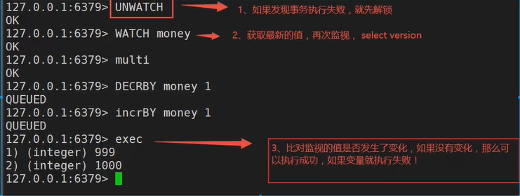

如果失败重新获取新的监视器


##### redis之springboot 使用redistemplate！

> 导入pom文件

```xml
        <dependency>
            <groupId>org.springframework.boot</groupId>
            <artifactId>spring-boot-starter-data-redis</artifactId>
        </dependency>
```

> application.yml配置文件

```yaml
spring:
  datasource:
    druid:
      url: jdbc:mysql://localhost:3306/order_db1?characterEncoding=utf-8&serverTimezone=UTC
      driverClassName: com.mysql.jdbc.Driver
      username: root
      password: root
      initialSize: 5  #初始建立连接数量
      minIdle: 5  #最小连接数量
      maxActive: 20 #最大连接数量
      maxWait: 10000  #获取连接最大等待时间，毫秒
      testOnBorrow: true #申请连接时检测连接是否有效
      testOnReturn: false #归还连接时检测连接是否有效
      timeBetweenEvictionRunsMillis: 60000 #配置间隔检测连接是否有效的时间（单位是毫秒）
      minEvictableIdleTimeMillis: 300000  #连接在连接池的最小生存时间
  redis:
    host: 192.168.182.128
    port: 6379
    database: 0

mybatis-plus:
  configuration:
    map-underscore-to-camel-case: true
  mapper-locations: mapper/*.xml
logging:
  level:
    com.zl.redis.dao.OrderMapper: info

server:
  port: 3003
```

> 配置redisTemplate的序列化方式

```java
    @Bean
    @SuppressWarnings("all")
    public RedisTemplate<String,Object> redisTemplate(RedisConnectionFactory factory){
        RedisTemplate<String,Object> redisTemplate = new RedisTemplate();
        redisTemplate.setConnectionFactory(factory);
        Jackson2JsonRedisSerializer jackson2JsonRedisSerializer=new Jackson2JsonRedisSerializer(Object.class);
        ObjectMapper om=new ObjectMapper();
        om.setVisibility(PropertyAccessor.ALL, JsonAutoDetect.Visibility.ANY);
        om.enableDefaultTyping(ObjectMapper.DefaultTyping.NON_FINAL);
        jackson2JsonRedisSerializer.setObjectMapper(om);
        StringRedisSerializer stringRedisSerializer=new StringRedisSerializer();

        //key采用string方式序列化
        redisTemplate.setKeySerializer(stringRedisSerializer);
        //hash的key也采用string的序列化
        redisTemplate.setHashKeySerializer(stringRedisSerializer);
        //value序列化采用jackson
        redisTemplate.setValueSerializer(jackson2JsonRedisSerializer);
        //hash的value采用jackson
        redisTemplate.setHashValueSerializer(jackson2JsonRedisSerializer);
        redisTemplate.afterPropertiesSet();
        return redisTemplate;
    }
```

使用RedisUtil工具类

##### redis的配置文件！

启动的时候，就通过配置文件来启动

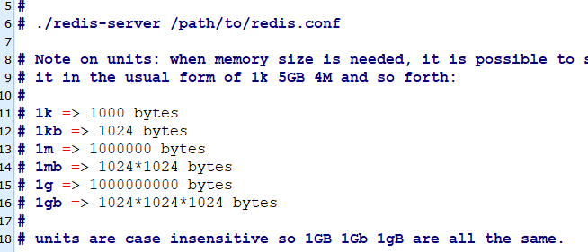

就好比我们学习spring，import，include

> 网络

```bash
bind 127.0.0.1 #绑定的ip

protected-mode yes #保护模式

port 6379 #端口号设置
```

> 通用GENERAL

```bash
daemonize yes #以守护进程的方式运行，默认是no，我们需要自己开启为yes！

pidfile /var/run/redis_6379.pid #如果以后台的方式运行，我们需要指定一个pid文件！

#日志
# Specify the server verbosity level.
# This can be one of:
# debug (a lot of information, useful for development/testing)
# verbose (many rarely useful info, but not a mess like the debug level)
# notice (moderately verbose, what you want in production probably)
# warning (only very important / critical messages are logged)
loglevel notice
logfile "日志的文件位置名"
databases 16 # "数据库的数量，默认是16个"
always-show-logo yes #是否总是显示logo
```

> 快照

持久化，在规定的时间内，执行了多少次操作，则会持久化到文件.rdb和.aof

redis是内存数据库，如歌没有持久化，那么断电及丢失！

```bash
#如歌900s内，如果至少有一个key进行了修改，我们就进行持久化操作
save 900 1
#如歌300s内，如果至少有10个key进行了修改，我们就进行持久化操作
save 300 10
#如歌60内，如果至少有10000个key进行了修改，我们就进行持久化操作
save 60 10000

stop-writes-on-bgsave-error yes  #如歌持久化出错，是否还需要工作！

rdbcompression yes #是否要压缩rdb文件，需要消耗cpu资源！

rdbchecksum yes #保存rdb文件的时候，进行错误检查校验！

dbfilename dump.rdb #rdb数据文件名称

dir ./ #rdb 文件保存的目录！
```

> replication 复制，见后面主从复制


> SECURITY安全

可以在config设置密码，默认是没有密码的！

```bash
127.0.0.1:6379> config get requirepass
1) "requirepass"
2) ""
127.0.0.1:6379> config set  requirepass 123456
OK
127.0.0.1:6379> config get requirepass
1) "requirepass"
2) "123456"
127.0.0.1:6379> config get requirepass
1) "requirepass"
2) "123456"
127.0.0.1:6379>
root@d2332374958c:/data# redis-cli
127.0.0.1:6379> config get requirepass
(error) NOAUTH Authentication required.
127.0.0.1:6379> auth 123456
OK
127.0.0.1:6379> config get requirepass
1) "requirepass"
2) "123456" 

```

> 限制 CLIENTS

```bash
maxclients 10000 #设置能连接上redis的最大客户端的数量
maxmemory <bytes> #配置redis的最大内存容量
maxmemory-policy:   #一下6种
#noeviction: 不删除策略, 达到最大内存限制时, 如果需要更多内存, 直接返回错误信息。（默认值）
#allkeys-lru: 所有key通用; 优先删除最近最少使用(less recently used ,LRU) 的 key。
#volatile-lru: 只限于设置了 expire 的部分; 优先删除最近最少使用(less recently used ,LRU) 的 key。
#allkeys-random: 所有key通用; 随机删除一部分 key。
#volatile-random: 只限于设置了 expire 的部分; 随机删除一部分 key。
#volatile-ttl: 只限于设置了 expire 的部分; 优先删除剩余时间(time to live,TTL) 短的key。
```

> APPEND ONLY 模式 aof配置

```bash
appendonly no #默认是不开启aof模式的，默认是使用rdb方式持久化，在大部分情况下，rdb完全够用！
appendfilename "appendonly.aof" #持久化文件名字！

#appendfsync always  #每次都会sync，消耗性能。
appendfsync everyec #每秒执行一次 sync，可能会丢失这1s的数据！
#appendfsync no
```

##### Redis持久化！

> 面试和工作，持久化都是种点！

Redis是内存数据库，如果不能将内存中的数据保存到磁盘，那么一旦服务器进程退出，服务器的数据也会消失，所以Redis提供了持久化功能！

RDB(Redis DataBase)


> 什么是RDB！


在指定的时间间隔内将内存中的数据集快照写入到磁盘，也就是Snapshot快照，它恢复时将快照文件直接读到内存中。


Redis会单独创建一个（fork）子进程来进行持久化，会先将数据写入到一个临时文件中，持久化过程都结束了，再用这个临时文件替换上一次持久化好的文件。整个过程中，主进程是不进行任何io操作的，这样就确保了极高的性能。如果需要进行大规模的恢复，且对于数据恢复完整性不敏感，那rdb方式都要比aof方式更加的高效。rdb的缺点是最后一次持久化后的数据可能丢失。默认就是rdb，一般情况不需要修改这个配置！

有时候在生产环境中我们会备份这个文件！

<font color="red">rdb保存的文件就是dump.rdb</font>


> 触发机制

1，save的规则满足的情况下，也会触发rdb规则！

2，执行flushall命令，也会触发我们的rdb规则！

3，退出redis，也会产生rdb文件！

备份就自动生成一个dump.rdb


> 如果恢复rdb文件！

1，只需要将rdb文件放在我们redis启动目录就可以，redis启动的时候会自动检查dump.rdb恢复其中的数据！

2，查看需要存在的位置

```bash
127.0.0.1:6379> config get dir
1) "dir"
2) "/data" #如果这个目录下存在dump.rdb文件，启动就会恢复其中数据
```

几乎默认的配置就够用了，但还是要去学习！

> 优点：

1，适合大规模的数据恢复！

2，对数据完整性要求不高！

> 缺点：

1，需要一定的时间间隔进程操作！如果宕机了，这个最后一次修改的数据就没有了！

2，fork进程的时候，会占用一定的内容空间！


> 什么是AOF！


以日志的形式来记录每一个写的操作，将redis执行过的所有指令记录下来（读操作不记录），只允许追加文件但不可以改写文件，redis启动之初会读取该文件重新构建数据，换言之，redis重启的话就根据日志文件的内容将写指令从前到后执行一次完成数据恢复工作！

<font color="red">aof保存的是 appendonly.aof文件</font>

默认是不开启的，需要手动开启！我们只需要将appendonly yes 就开启了aof

如果这个aof文件有错为，redis是启动不起来的，我们需要修复aof文件

redis提供了一个工具修复aof

```bash
redis-check-aof --fix appendonly.aof
```

> 重写规则

```bash
auto-aof-rewrite-percentage 100

auto-aof-rewrite-min-size 64mb #如歌aof文件超过了64m，fork一个新的进程来将我们的文件进行重写！
```


> 优点缺点！

> 优点：

1，每一次修改都同步，文件完整会更好！

2，每秒同步一次，可能会丢失一秒的数据

3，从不同步，效率最高！

> 缺点：

1，相同于数据文件来说，aof远远大于rdb，修复的速度也比rdb慢！

2，aof运行也要比rdb慢，所以我们的默认配置就是rdb

```bash
appendonly no #默认是不开启aof模式的，默认是使用rdb方式持久化，在大部分情况下，rdb完全够用！
appendfilename "appendonly.aof" #持久化文件名字！

#appendfsync always  #每次都会sync，消耗性能。
appendfsync everyec #每秒执行一次 sync，可能会丢失这1s的数据！
#appendfsync no

#rewrite 重写
```

> 扩展:

1、RDB持久化方式能够在指定的时间间隔内对你的数据进行快照存储

2、AOF 持久化方式记录每次对服务器写的操作，当服务器重启的时候会重新执行这些命令来恢复原始的数据，AOF命令以Redis协议追加保存每次写的操作到文件末尾，Redis还能对AOF文件进行后台重写，使得AOF文件的体积不至于过大。

3、只做缓存，如果你只希望你的数据在服务器运行的时候存在,你也可以不使用任何持久化

4、同时开启两种持久化方式

●在这种情况下，当redis重启的时候会优先载入AOF文件来恢复原始的数据，因为在通常情况下AOF文件保存的数据集要比RDB文件保存的数据集要完整。

. RDB 的数据不实时，同时使用两者时服务器重启也只会找AOF文件，那要不要只使用AOF呢?作者建议不要，因为RDB更适合用于备份数据库( AOF在不断变化不好备份)， 快速重启，而且不会有AOF可能潜在的Bug ,留着作为一一个万一 -的手段。

5、性能建议

●因为RDB文件只用作后备用途，建议只在Slave上持久化RDB文件，而且只要15分钟备份一次就够了，只保留save 9001这条规则。

●如果Enable AOF，好处是在最恶劣情况下也只会丢失不超过两秒数据，启动脚本较简单只load自己的AOF文件就可以了，代价-是带来了持续的I0，二是AOF rewrite的最后将rewrite过程中产生的新数据写到新文件造成的阻塞几乎是不可避免的。只要硬盘许可，应该尽量减少AOF rewrite的频率，AOF重写的基础大小默认值64M太小了,可以设到5G以上，默认超过原大小100%大小重写可以改到适当的数值。

●如果不Enable AOF仅靠 Master: Slave Repllcation 实现高可用性也可以，能省掉一大笔I0. 也减少了rewrite时带来的系统 波动。代价是如果Master/Slave 同时倒掉，会丢失十几分钟的数据，启动脚本也要比较两个Master/Slave中的RDB文件，载入较新的那个，微博就是这种架构。 

##### Redis发布订阅！

Redis 发布订阅（pub/sub） 是一种消息通信模式：发送者（pub）发送消息，订阅这（sub）获取消息。微信，微博，关注系统！

redis订阅客户端可以订阅任意数量的频道。

订阅/发布消息图：

第一个：消息发送者，第二个   ：频道

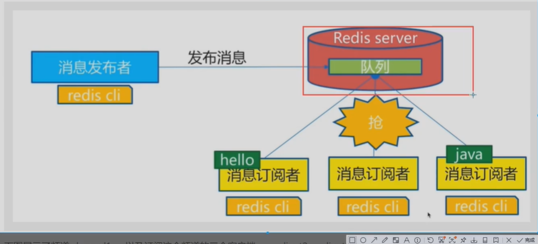

下图展示了频道channel1，以及订阅这个频道的三个客户端--client2，client5和client1之间的关系：


所有新消息通过publish命令发送给频道channel1时，这个消息就会被发送给订阅它的三个客户端：

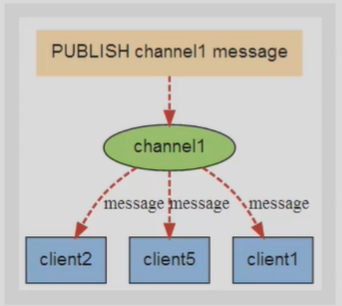

> 命令

这些命令被广泛用于构建即使通信应用，比如聊天室和实时广播，实时提醒等。

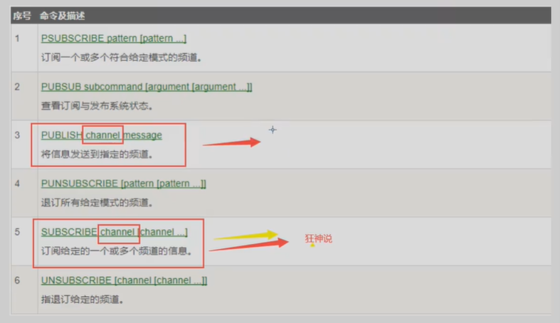

##### Redis主从复制！

**概念**

 主从复制,是指将一台Redis服务器的数据， 复制到其他的Redis服务器。前者称为主节点(master/leader) ,后者称为从节点(slave/follower) ;<font color="red">数据的复制是单向的，只能由主节点到从节点。</font>Master以写为主 ，Slave以读为主。

默认情况下，每台Redis服务器都是主节点;且一个主节点可以有多个从节点(或没有从节点)，但-一个从节点只能有一个主节点。

主从复制的作用主要包括:

1、数据冗余:主从复制实现了数据的热备份，是持久化之外的一种数据冗余方式。

2、故障恢复:当主节点出现问题时，可以由从节点提供服务，实现快速的故障恢复;实际上是一种服务的冗余。

3、负载均衡:在主从复制的基础，上，配合读写分离，可以由主节点提供写服务，由从节点提供读服务(即写Redis数据时应用连接主节点,读Redis数据时应用连接从节点)， 分担服务器负载;尤其是在写少读多的场景下，通过多个从节点分担读负载,可以大大提高Redis服务器的并发量。

4、高可用基石:除了上述作用以外，主从复制还是哨兵和集群能够实施的基础，因此说主从复制是Redis高可用的基础。

一般来说，要将Redis运用于工程项目中，只使用一台Redis是万万不能的（最小3个），原因如下:

1、从结构上,单个Redis服务器会发生单点故障，并且-台服务器需要处理所有的请求负载,压力较大;

2、从容量上，单个Redis服务器内存容量有限，就算一台Redis服务 器内存容量为256G，也不能将所有内存用作Redis存储内存，一般来说 ，<font color="red">单台Redis最大使用内存不应该超过20G。</font>

电商网站上的商品，般都是一次上传,无数次浏览的，说专业点也就是”多读少写"。

对于这种场景，我们可以使用如下这种架构：

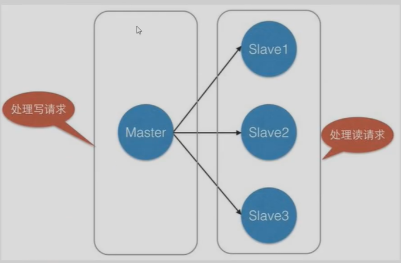 

主从复制读写分离！80%情况下都是在进行读的操作！减缓服务器的压力！架构中经常使用！一主二从！

只要在公司中，主从复制是必须要使用的，因为在真实的项目中不可能使用单机版的！

###### 环境配置

```bash
127.0.0.1:6379> info replication
# Replication
role:master
connected_slaves:0
master_replid:b34747f73576bc50ac73c16a8dc7a954e873e373
master_replid2:0000000000000000000000000000000000000000
master_repl_offset:0
master_repl_meaningful_offset:0
second_repl_offset:-1
repl_backlog_active:0
repl_backlog_size:1048576
repl_backlog_first_byte_offset:0
repl_backlog_histlen:0
```

> 复制三个配置文件，然后修改对应信息

1，端口

2，pid名

3，log文件名

4，dump.rdb名

启动redis集群服务

```bash
root@ubuntu:~# redis-server /etc/redis/redis70.config
root@ubuntu:~# redis-server /etc/redis/redis8000.config
```

> 查看进程是否启动

```bash
root@ubuntu:~# ps -ef|grep redis
redis     11023      1  0 01:39 ?        00:00:01 /usr/bin/redis-server 127.0.0.1:6379
root      15255      1  0 01:48 ?        00:00:00 redis-server 127.0.0.1:6378
root      16110      1  0 01:50 ?        00:00:00 redis-server
127.0.0.1:6377
root      16205  15583  0 01:51 pts/1    00:00:00 grep --color=auto redis

```

> 配置从机

```bash

127.0.0.1:6378> SLAVEOF 127.0.0.1 6379 #选择当前节点的主节点
OK
127.0.0.1:6378> info replication
# Replication
role:slave
master_host:127.0.0.1
master_port:6379
master_link_status:up
master_last_io_seconds_ago:1
master_sync_in_progress:0
slave_repl_offset:0
slave_priority:100
slave_read_only:1
connected_slaves:0
master_replid:087fc20477e1305f67c28c9ea836a6ad174b804d
master_replid2:0000000000000000000000000000000000000000
master_repl_offset:0
second_repl_offset:-1
repl_backlog_active:1
repl_backlog_size:1048576
repl_backlog_first_byte_offset:1
repl_backlog_histlen:0
```

真实的主从配置应该是在配置文件中配置的，这样的话是永久的，我们这里使用的命令，暂时！

细节

主机可以写，从机不能写只读！从机中的所有信息和数据，都会自动被从机保存！

```bash
#主机
127.0.0.1:6379> set k1 v1
OK
#从机
127.0.0.1:6378> get k1
"v1"
```

从机只能读不能写

```bash
127.0.0.1:6378> set k1 v1
(error) READONLY You can't write against a read only slave.
```

测试：主机断开连接，从机依旧连接主机，但是没有写操作，这个时候，主机重新启动，从机依旧可以直接获取到主机的信息！

 如果是使用命令行来配置主从，如果这时候重启了。从机会变成主机！只要变为从机就会从主机中获取值！

> 复制原理

 Slave启动成功连接到master后会发送一个sync同步命令

Master接到命令，启动后台的存盘进程，同时收集所有接收到的用于修改数据集命令,在后台进程执行完毕之后,<font color="red"> master将传送整个数据文件到slave，并完成一次完全同步。</font>

全量复制:而slave服务在接收到数据库文件数据后，将其存盘并加载到内存中。

增量复制: Master继续将新的所有收集到的修改命令依次传给slave，完成同步但是只要是重新连接master ,一-次完全同步(全量复制)将被自动执行。

我们的数据一定会在从机中看到！ 

>层层链路

上一个m连接下一个s!

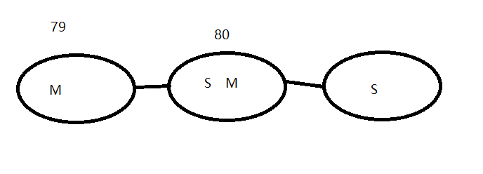

这个也可以完成主从复制！

>如果没有主节点了，可不可以选择一个主节点？手动！

<font color="red">谋朝篡位</font>

如果主机断开了连接，我们可以使用`slaveof no one` 让自己变成主机！其他节点就可以手动连接到最新的这个主节点（手动）！如果这个时候主恢复了就需要重新连接！

###### 哨兵模式

（自动选举老大的模式）

> 概述

主从切换技术的方法是∶当主服务器宕机后，需要手动把一台从服务器切换为主服务器，这就需要人工干预，费事费力，还会造成一段时间内服务不可用。这不是一种推荐的方式，更多时候，我们优先考虑哨兵模式。Redis从2.8开始正式提供了Sentinel(哨兵）架构来解决这个问题。
谋朝篡位的自动版，能够后台监控主机是否故障，如果故障了根据投票数自动将从库转换为主库。
哨兵模式是一种特殊的模式，首先Redis提供了哨兵的命令，哨兵是一个独立的进程，作为进程，它会独立运行。**其原理是哨兵通过发送命令，等待Redis服务器响应，从而监控运行的多个Redis实例。**

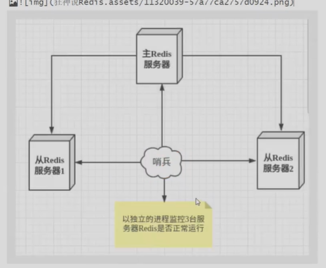

这里的哨兵有两个作用

- 通过发送命令，让Redis服务器返回监控其运行状态，包括主服务器和从服务器。

- 当哨兵监测到master宕机，会自动将slave切换成master，然后通过发布订阅模式通知其他的从服务器，修改配置文件，让它们切换主机。

  然而一个哨兵进程对Redis服务器进行监控，可能会出现问题，为此，我们可以使用多个哨兵进行监控。各个哨兵之间还会进行监
  控，这样就形成了多哨兵模式。


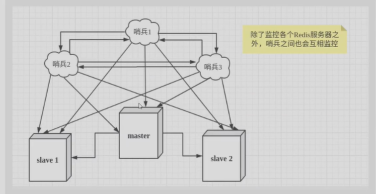

假设主服务器宕机，哨兵1先检测到这个结果，系统并不会马上进行failover过程，仅仅是哨兵1丰观的认为主服务器不可用，这个现象成为**主观下线**当后面的哨兵也检测到主服务器不可用，并且数量达到一定值时，那么哨兵之间就会进行一次投票，投票的结果由一个哨兵发起，进failover[故障转移]操作。切换成功后，就会通过发布订阅模式，让各个哨兵把自己监控的从服务器实现切换主机，这个过程称为**客观下线**。

>测试！

一主二从模式！

1，配置哨兵配置文件sentinel.config

```bash
#sentinel monitor 监控的名称 host port 1
sentinel monitor myredis 127.0.0.1 6379 1
```

后面这个数字1，代表主机挂了，slave投票看让谁接替成为主机，票数最多的，就会成为主机！

2，启动哨兵！

redis-sentinel /etc/redis/sentinel.conf

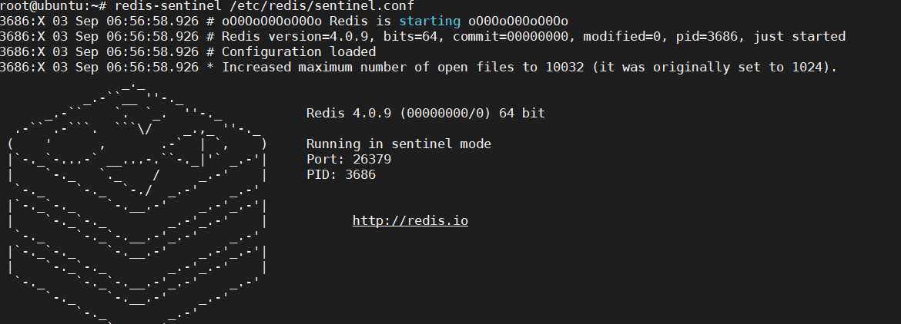

关闭主机

```bash

3686:X 03 Sep 07:03:01.661 # +sdown master myredis 127.0.0.1 6379
3686:X 03 Sep 07:03:01.661 # +odown master myredis 127.0.0.1 6379 #quorum 1/1
3686:X 03 Sep 07:03:01.661 # +new-epoch 1
3686:X 03 Sep 07:03:01.661 # +try-failover master myredis 127.0.0.1 6379
3686:X 03 Sep 07:03:01.664 # +vote-for-leader 9f09c4565f5e754d4f617147a5df853a159dd043 1
3686:X 03 Sep 07:03:01.664 # +elected-leader master myredis 127.0.0.1 6379
3686:X 03 Sep 07:03:01.664 # +failover-state-select-slave master myredis 127.0.0.1 6379
3686:X 03 Sep 07:03:01.736 # -failover-abort-no-good-slave master myredis 127.0.0.1 6379
3686:X 03 Sep 07:03:01.794 # Next failover delay: I will not start a failover before Thu Sep  3 07:09:02 2020

```

如果master节点断开了，这个时候会从从机中选举出主机！

如果主机此时回来了，只能归并到新的主机下，当做主机，这就是哨兵模式！

> 哨兵模式

优点：

1，哨兵集群，基于主从复制模式，所有的主从配置优点，它全有

2，主从可以切换，故障可以转移，系统的可用性就会更好

3，哨兵模式就是主从模式的升级，手动到自动，更加健壮！

缺点：

1，Redis不好啊在线扩容，集群容量一旦达到上限，在线扩容十分麻烦！

2，实现哨兵模式的配置其实很麻烦的，里面有很多选择！

> 哨兵模式的全部配置

###### 配置前哨

Redis源分发包含一个名为的文件`sentinel.conf` ，该文件是一个自说明性的示例配置文件，可用于配置Sentinel，但是典型的最小配置文件如下所示：

```bash
sentinel monitor mymaster 127.0.0.1 6379 2
sentinel down-after-milliseconds mymaster 60000
sentinel failover-timeout mymaster 180000
sentinel parallel-syncs mymaster 1

sentinel monitor resque 192.168.1.3 6380 4
sentinel down-after-milliseconds resque 10000
sentinel failover-timeout resque 180000
sentinel parallel-syncs resque 5
#Example sentinel.conf
#哨兵sentine1实例运行的端口默认26379
port 26379
#哨兵sentine1的工作目录
dir/tmp
#哨兵sentinel监控的redis主节点的 ip port
# master-name可以自己命名的主节点名字只能由字母A-z、数字0-9 、这三个字符".-_"组成。
# quorum配置多少个sentine1哨兵统一认为master主节点失联那么这时客观上认为主节点失联了
# sentinel monitor <master-name> <ip> <redis-port> <quorum>
sentinel monitor mymaster 127.0.0.1 6379 2
#当在Redis实例中开启了requirepass foobared 投权密码这样所有连接Redis实例的客户端都要提供密码
#设置哨兵sentinel连接主从的密码注意必须为主从设置一样的验证密码
#sentinel auth-pass <master-name> <password>
sentinel auth-pass mymaster MysUPER--secret-o123passwOrd
#指定多少毫秒之后主节点没有应答哨兵sentinel此时哨兵主观上认为主节点下线默认30秒
# sentinel down-after-mi1liseconds <master-name> <mil1iseconds>
sentinel down-after-mi11iseconds mymaster 3000o
#这个配置项指定了在发生failover主备切换时最多可以有多少个slave同时对新的master进行同步，
这个数字越小，完成failover所需的时间就越长，
但是如果这个数字越大，就意味着越多的slave因为replication而不可用。
可以通过将这个值设为1来保证每次只有一个slave处于不能处理命令请求的状态。
# sentinel paralle1-syncs <master-name><numslaves>
sentinel parallel-syncs mymaster 1
#故障转移的超时时间failover-timeout 可以用在以下这些方面:
#1，同一个sentine1对同一个master两次failover之间的间隔时间。
#2，当一个slave从一个错误的master那里同步数据开始计算时间。直到slave被纠正为向正确的master那里同步数据时。
#3.当想要取消一个正在进行的failover所需要的时间。
#4.当进行failover时，配置所有slaves指向新的master所需的最大时间。不过，即使过了这个超时，slaves依然会被正确配置为指向
master，但是就不按para7le1-syncs所配置的规则来了
#默认三分钟
#sentinel failover-timeout <master-name> <mi1liseconds>
sentinel failover-timeout mymaster 180000
#SCRIPTS EXECUTION
#配置当某一事件发生时所需要执行的脚本，可以通过脚本来通知管理员，例如当系统运行不正常时发邮件通知相关人员。
#对于脚本的运行结果有以下规则:
#若脚本执行后返回1，那么该脚本稍后将会被再次执行，重复次数目前默认为10
#若脚本执行后返回2，或者比2更高的一个返回值，脚本将不会重复执行。
#如果脚本在执行过程中由于收到系统中断信号被终止了，则同返回值为1时的行为相同。
#一个脚本的最大执行时间为60s，如果超过这个时间，脚本将会被一个SIGKILL信号终止，之后重新执行。
#通知型脚本:当sentine1有任何警告级别的事件发生时（比如说redis实例的主观失效和客观失效等等)，将会去调用这个脚本，这时这
脚本应该通过邮件，SMS等方式去通知系统管理员关于系统不正常运行的信息。调用该脚本时，将传给脚本两个参数，一个是事件的类型，一个是事件的描述。如果sentine1.conf配置文件中配置了这个脚本路径，那么必须保证这个脚本存在于这个路径，并且是可执行的，否则sentinel无法正常启动成功。
#通知脚本
#sentinel notification-script master-name> <script-path>
#shell编程
sentinel notification-script mymaster /var/redis/notify.sh
#客户端重新配置主节点参数脚本
#当一个master由于failover而发生改变时，这个脚本将会被调用，通知相关的客户端关于master地址已经发生改变的信息。
#以下参数将会在调用脚本时传给脚本:
# <master-name> <role> <state> <from-ip> <from-port> <to-ip> <to-port>
#目前<state>总是“failover”，
#<role>是“leader”或者“observer”中的一个。
#参数from-ip，from-port，to-ip，to-port是用来和旧的master和新的master(即旧的slave)通信的
#这个脚本应该是通用的，能被多次调用，不是针对性的。
# sentinel c1ient-reconfig-script master-name> <script-path>
sentinel c1ient-reconfig-script master-name> <script-path> #一般是运维配置
```


##### 使用redis所遇到的问题是什么？

##### 在项目中如何使用redis的？

##### 怎么解决缓存击穿，缓存穿透和雪崩（面试高频，工作常用）？

<font color="red">高可用问题！</font>

Redis缓存的使用，极大的提升了应用程序的性能和效率，特别是数据查询方面。但同时，它也带来了一些问题。其中，最要害的问题，就是数据的一致性问题，从严格意义上讲，这个问题无解。如果对数据的一致性要求很高，那么就不能使用缓存。
另外的一些典型问题就是，缓存穿透、缓存雪崩和缓存击穿。目前，业界也都有比较流行的解决方案。

###### 缓存穿透（查不到！）

> 概念

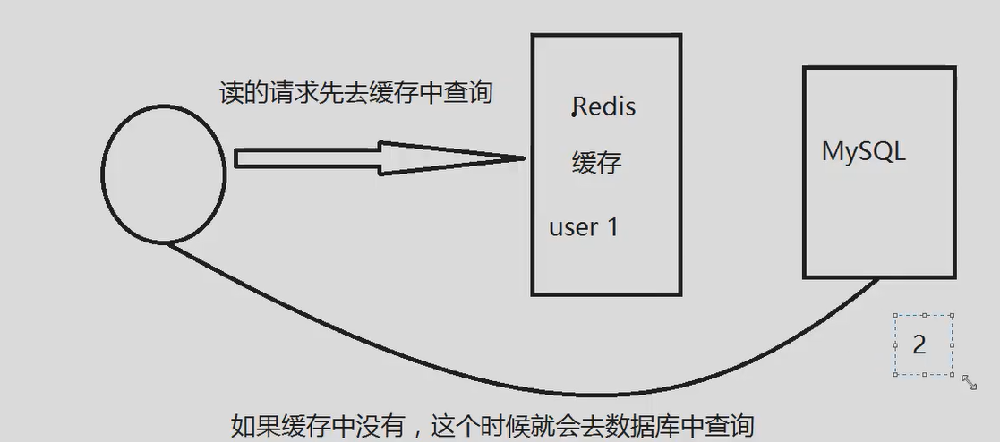


据库造成很大的压力，这时候就相当于出现了缓存穿透。缓存穿透的概念很简单，用户想要查询一个数据，发现redis内存数据库没有，也就是缓存没有中，于是向持久层数据库查询。发现也没有，于是本次查询失败。当用户很多的时候，缓存都没有命中（秒杀!），于是都去请求了持久层数据库。这会给持久层数！

> 解决方案

布隆过滤器

布隆过滤器是一种数据结构，对所有可能查询的参数以hash形式存储，在控制层先进行校验，不符合则丢弃，从而避免了对底层存储系统的查询压力;

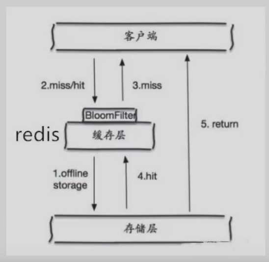

**缓存空对象**

当存储层不命中后，即使返回的空对象也将其缓存起来，同时会设置一个过期时间，之后再访问这个数据将会从缓存中获取，保护了后端数据源;

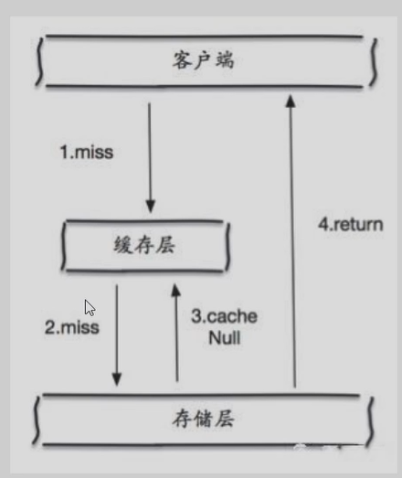

但是这种方法会存在2个问题：

1，如果空值能够被存储起来，意味着缓存需要更多的空间来存储更多的键，因为这当中可能会存在很多空值的键；

2，即使对空值设置了过期时间，还是会在缓存层和存储层的数据会有一段时间窗口的不一致，这对于需要保持一致性的业务会有影响。


###### 缓存击穿（量太大，缓存过期！）

>概述

这里需要注意和缓存击穿的区别，缓存击穿，是指一个key非常热点，在不停的扛着大并发，为并发集中对这一个点进行访问，当这个key在失效的瞬间，持续的大并发就穿破缓存，直接请求数据库，就像在一个屏障上凿开了一个洞。
当某个key在过期的瞬间，有大量的请求并发访问，这类数据一般是热点数据，由于缓存过期，会同时访问数据库来查询最新数据，并且回写缓存，会导使数据库瞬间压力过大。

> 解决方案

**设置热点数据永不过期**

从缓存层来看，没有设置过期时间，所以不会出现热点key过期后产生的问题。

**加互斥锁**   setnx

分布式锁 ：使用分布式锁，保证对于每个key同时只有一个线程去查询后端服务，其他线程没有获得到分布式锁的权限，因此只有需要等待即可。这种方式将高并发的压力转移到了分布式锁，因此对分布式锁的考验很大。

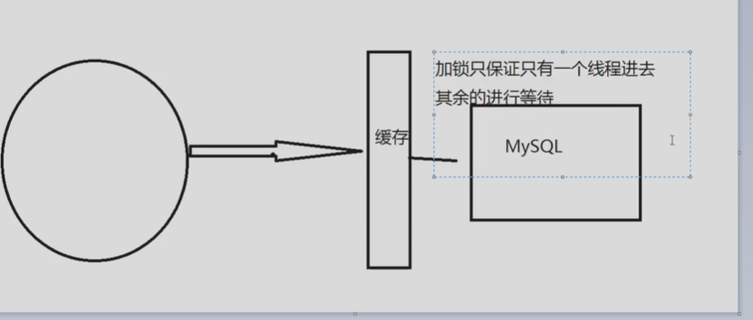

###### 缓存穿透

> 概述

缓存雪崩，是指在某一个时间段，缓存集中过期失效。Redis宕机!
产生雪崩的原因之一，比如在写本文的时候，马上就要到双十二零点，很快就会迎来一波抢购，这波商品时间比较集中的放入了缓存，假设缓存一个小时。那么到了凌晨一点钟的时候，这批商品的缓存就都过期了。而对这批商品的访问查询，都落到了数据库上，对于数据库而言，就会产生周期性的压力波峰。于是所有的请求都会达到存储层，存储层的调用量会暴增，造成存储层也会挂掉的情况。

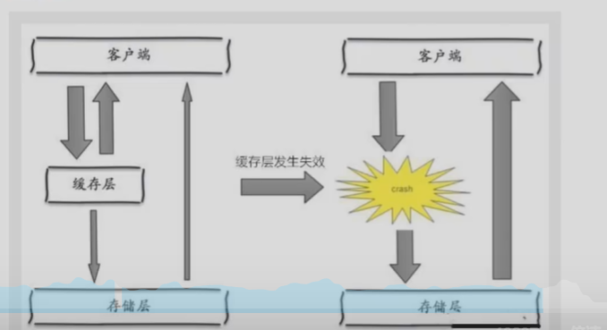

其实集中过期，倒不是非常致命，比较致命的缓存雪崩，是缓存服务器某个节点宕机或断网。因为自然形成的缓存雪崩，一定是在某个时间段集中创建缓存，这个时候，数据库也是可以顶住压力的。无非就是对数据库产生周期性的压力而已。而缓存服务节点的宕机，对数据库服务器造成的压力是不可预知的，很有可能瞬间就把数据库压垮。

双十一：停掉一些服务，（保证主要的服务可用）

>解决方案

**redis高可用**

这个思想的含义是，既然redis有可能挂掉，那我多增设几台redis，这样一台挂掉之后其他的还可以继续工作，其实就是搭建集群。（异地多活！）

**限流降级**

通过加锁或者队列来控制读数据库写数据库的线程数。比如对某个key只允许一个线程查询数据和写缓存，其他线程等待。

**数据预热**

数据加热的含义就是在正式部署之前，我们可以把所有的数据先预访问一遍，这样部分可能大量访问的数据就会加载到缓存中。即将发生大并发访问前手动触发加载缓存不同的key，设置不同的过期时间，让缓存失效的时间尽量均匀。